<!-- ─────────────────────────────────────────────────────────────────────────
  astoris — profile readme
  paper & ink · rust accent · no ceremony
  edit the // NOW // block and the featured-projects block as life happens.
  everything else is self-updating via Actions (see .github/workflows/).
  ───────────────────────────────────────────────────────────────────────── -->

<p align="center">
  
</p>

<p align="center">
  <a href="https://astoris.dev"></a>
  
  <a href="mailto:astoris@example.com"></a>
  
</p>

<br/>

<!-- ── 01 · whoami ─────────────────────────────────────────────────────── -->

<table width="100%" border="0">
<tr>
<td valign="top" width="55%">

### <sub><code>01 · ABOUT</code></sub>

> _"Low-level programmer with a mild procrastination habit.<br/>
> I like small, sharp programs, the weird corners of languages,<br/>
> and things that compile to **exactly what you wrote**."_

I'm **Astoris** — I spend most of my time reading other people's source
and poking at the weird corners of languages. Fewer layers. Closer to
the metal. Honest programs.

Not shipping anything loud yet — more forks, more notebooks, more tabs
left open overnight.

</td>
<td valign="top" width="45%">



</td>
</tr>
</table>

<br/>

<!-- ── 02 · now · edit this block by hand ──────────────────────────────── -->

### <sub><code>02 · /NOW</code></sub>

<!-- NOW:START -->
```txt
reading   →  claude-code source
poking    →  symbolic regression in mathematica
building  →  permanent-portfolio · astoris.dev
avoiding  →  anything with a framework in the name
```
<!-- NOW:END -->

<sub><em>last edited by hand — `/now` is a ritual, not a feed.</em></sub>

<br/>

<!-- ── 03 · stack ──────────────────────────────────────────────────────── -->

### <sub><code>03 · THE STACK I REACH FOR</code></sub>

<p>
  
  
  
  
  
  
  
  
  
  
</p>

<sub>the short list. the long list is in my shell history.</sub>

<br/>

<!-- ── 04 · stats — live ───────────────────────────────────────────────── -->

### <sub><code>04 · STATS, LIVE</code></sub>

<p>
  <!-- theme-aware stats: light & dark via prefers-color-scheme -->
  <picture>
    <source media="(prefers-color-scheme: dark)" srcset="https://github-readme-stats.vercel.app/api?username=AstorisTheBrave&show_icons=true&hide_border=true&bg_color=07070a&title_color=e27a52&icon_color=e27a52&text_color=ece7dc&include_all_commits=true&count_private=true" />
    
  </picture>
</p>
<p>
  <picture>
    <source media="(prefers-color-scheme: dark)" srcset="https://github-readme-streak-stats.herokuapp.com/?user=AstorisTheBrave&hide_border=true&background=07070a&stroke=1f1d1a&ring=e27a52&fire=e27a52&currStreakLabel=e27a52&sideLabels=a8a49b&currStreakNum=ece7dc&sideNums=ece7dc&dates=6b6760" />
    
  </picture>
</p>
<p>
  <picture>
    <source media="(prefers-color-scheme: dark)" srcset="https://github-readme-stats.vercel.app/api/top-langs/?username=AstorisTheBrave&layout=compact&hide_border=true&bg_color=07070a&title_color=e27a52&text_color=ece7dc&langs_count=8" />
    
  </picture>
</p>

<br/>

<!-- ── 05 · snake ──────────────────────────────────────────────────────── -->

### <sub><code>05 · A SNAKE, EATING MY CONTRIBUTIONS</code></sub>

<p align="center">
  <picture>
    <source media="(prefers-color-scheme: dark)" srcset="https://raw.githubusercontent.com/AstorisTheBrave/AstorisTheBrave/output/github-snake-dark.svg" />
    
  </picture>
</p>

<sub>regenerated every 6h by a GitHub Action. see <code>.github/workflows/snake.yml</code>.</sub>

<br/>

<!-- ── 06 · spotify ────────────────────────────────────────────────────── -->

### <sub><code>06 · PLAYING RIGHT NOW</code></sub>

<!-- SPOTIFY:START -->
<!-- this block is rewritten by .github/workflows/spotify.yml every 5 minutes -->
<p><em>— nothing playing. probably deep in a man page. —</em></p>
<!-- SPOTIFY:END -->

<br/>

<!-- ── 07 · quote — rotated daily by Action ────────────────────────────── -->

### <sub><code>07 · QUOTE, DAILY</code></sub>

<!-- QUOTE:START -->
> _"Programs must be written for people to read, and only incidentally for machines to execute."_ — **Harold Abelson**
<!-- QUOTE:END -->

<br/>

<!-- ── 08 · hidden ─────────────────────────────────────────────────────── -->

### <sub><code>08 · HIDDEN</code></sub>

<details>
  <summary><sub><code>$ cat .bashrc | tail -n 1</code></sub></summary>
  <br/>
  <pre><code>alias plz='sudo $(fc -ln -1)'</code></pre>
  <sub>you scrolled this far. here's a second one:</sub>
  <pre><code>function cd() { builtin cd "$@" && ls; }
# small, sharp, quiet. like the rest of this readme.</code></pre>
</details>

<details>
  <summary><sub><code>$ man astoris</code></sub></summary>
  <br/>

  ```
  NAME
        astoris — low-level programmer, mild procrastination habit

  SYNOPSIS
        astoris [--reading <source>] [--poking <language>]
                [--avoiding <framework>] [--shipping? no]

  DESCRIPTION
        A small, sharp program. Takes longer than estimated.
        Produces honest output. No telemetry. No ceremony.

  FILES
        ~/astoris/permanent-portfolio    the canonical site
        ~/astoris/.config/philosophy.md  fewer layers
        ~/astoris/.config/signoff.md     hand-written HTML & opinions

  BUGS
        procrastinates. see ISSUES.md (eventually).

  SEE ALSO
        astoris.dev(7), github(7), coffee(1)
  ```

</details>

<details>
  <summary><sub><code>$ ./easter-egg --verbose</code></sub></summary>
  <br/>

  ```
                   ╭──────────────────────────────╮
                   │   ※                          │
                   │     you are the 01 person    │
                   │     to read this far.        │
                   │                              │
                   │     (yes, 01 in binary.      │
                   │      low-level joke.)        │
                   │                              │
                   │     — astoris                │
                   ╰──────────────────────────────╯
  ```

  <sub>drop me a line: <a href="mailto:astoris@example.com">astoris@example.com</a> — subject line <code>0b1</code> for priority.</sub>
</details>

<br/>

<!-- ── 09 · sign-off ───────────────────────────────────────────────────── -->

<p align="center">
  <sub>
    <code>※</code> &nbsp;
    hand-written HTML &amp; opinions
    &nbsp;·&nbsp; no trackers
    &nbsp;·&nbsp; <a href="https://astoris.dev">astoris.dev</a>
  </sub>
</p>

<p align="center">
  
</p>
