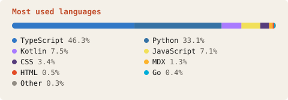

<!-- ─────────────────────────────────────────────────────────────────────────
  astoris - profile readme
  paper & ink · rust accent · no ceremony
  edit the // NOW // block as life changes.
  everything else is self-updating via Actions (see .github/workflows/).
  ───────────────────────────────────────────────────────────────────────── -->

<p align="center">
  
</p>

<p align="center">
  <a href="https://astoris.dev"></a>
  
  <a href="mailto:AstorisTheBrave@proton.me"></a>
  
</p>

<br/>

<!-- ── 01 · about ─────────────────────────────────────────────────────── -->

### <sub><code>01 · ABOUT</code></sub>

I'm **Astoris**. I build backends and Discord bots - right now [**Rostra**](https://github.com/AstorisTheBrave/Rostra), an all-in-one moderation and automod bot, and [**argus**](https://github.com/AstorisTheBrave/argus), which adds Prometheus/OpenTelemetry metrics to discord.py. Mostly Python and TypeScript, with some Go, deployed on AWS, Cloudflare, and Porter.run.

I care about services that stay up and APIs that are boring to use. Still learning a lot of this as I go.

<p align="center">
  
</p>

<br/>

<!-- ── 02 · now · edit this block by hand ──────────────────────────────── -->

### <sub><code>02 · /NOW</code></sub>

<!-- NOW:START -->
```txt
building  ->  rostra - an all-in-one discord bot
also      ->  argus - prometheus/otel metrics for discord.py
learning  ->  observability: opentelemetry + prometheus
```
<!-- NOW:END -->

<sub><em>edited by hand whenever this changes.</em></sub>

<br/>

<!-- ── 03 · stack ──────────────────────────────────────────────────────── -->

### <sub><code>03 · THE STACK I REACH FOR</code></sub>

<p>
  
  
  
  
  
  
  
  
  
  
  
  
  
</p>

<sub>mostly Python and TypeScript these days.</sub>

<br/>

<!-- ── 04 · stats ─────────────────────────────────────────────────────── -->

### <sub><code>04 · STATS, LIVE</code></sub>

<p align="center">
  <picture>
    <source media="(prefers-color-scheme: dark)" srcset="./assets/metrics-dark.svg" />
    
  </picture>
</p>

<sub>rank and a year of activity - rendered to a static SVG every 12h by a GitHub Action (no view-time API calls, so it always loads). see <code>.github/workflows/metrics.yml</code>.</sub>

<br/>

<p align="center">
  <picture>
    <source media="(prefers-color-scheme: dark)" srcset="./assets/languages-dark.svg" />
    
  </picture>
</p>

<sub>languages by share of bytes across every repo (this profile repo is skipped - it's HTML and takes an automated commit each week).</sub>

<br/>

<!-- ── 05 · snake ──────────────────────────────────────────────────────── -->

### <sub><code>05 · A SNAKE, EATING MY CONTRIBUTIONS</code></sub>

<p align="center">
  <picture>
    <source media="(prefers-color-scheme: dark)" srcset="https://raw.githubusercontent.com/AstorisTheBrave/AstorisTheBrave/output/github-snake-dark.svg" />
    
  </picture>
</p>

<sub>regenerated every 6h by a GitHub Action. see <code>.github/workflows/snake.yml</code>.</sub>

<br/>

<!-- ── 06 · projects ───────────────────────────────────────────────────── -->

### <sub><code>06 · FEATURED PROJECTS</code></sub>

**[Aegis](https://github.com/AstorisTheBrave/aegis)** &nbsp; <sub>`TypeScript`</sub>

Self-hosted SaaS access governance: an explainable access graph for identities, entitlements, reviews, evidence, and governed workflows. It is intentionally read-only in v1.

**[URSA](https://github.com/AstorisTheBrave/ursa-android)** &nbsp; <sub>`Kotlin`</sub>

A native, privacy-first Android companion for Uptime Kuma. It delivers real-time monitor status, heartbeat history, and FOSS push notifications without Firebase or a relay.

**[Rostra](https://github.com/AstorisTheBrave/Rostra)** &nbsp; <sub>`TypeScript`</sub>

An all-in-one Discord platform for moderation, server security, automod, tickets, applications, and community features — built as a fast, sharded service.

**[argus](https://github.com/AstorisTheBrave/argus)** &nbsp; <sub>`Python`</sub>

Operational Prometheus and OpenTelemetry for discord.py: one-line instrumentation for latency, command timings, gateway health, cache stats, and a live dashboard.

<br/>

<!-- ── 07 · quote - rotated weekly by Action ───────────────────────────── -->

### <sub><code>07 · QUOTE, WEEKLY</code></sub>

<!-- QUOTE:START -->
> _"Any fool can write code that a computer can understand. Good programmers write code that humans can understand."_ - **Martin Fowler**
<!-- QUOTE:END -->

<br/>

<!-- ── 08 · hidden ─────────────────────────────────────────────────────── -->

### <sub><code>08 · HIDDEN</code></sub>

<details>
  <summary><sub><code>$ cat .bashrc | tail -n 1</code></sub></summary>
  <br/>
  <pre><code>alias plz='sudo $(fc -ln -1)'</code></pre>
  <sub>you scrolled this far. here's a second one:</sub>
  <pre><code>function cd() { builtin cd "$@" && ls; }
# small, sharp, quiet. like the rest of this readme.</code></pre>
</details>

<details>
  <summary><sub><code>$ man astoris</code></sub></summary>
  <br/>

  ```
  NAME
        astoris - backend developer, mild procrastination habit

  SYNOPSIS
        astoris [--building <service>] [--debugging <query>]
                [--avoiding <orm>] [--shipping? eventually]

  DESCRIPTION
        Builds backends. APIs, databases, and the pipes between them.
        Takes longer than estimated. Produces honest output.
        No unnecessary abstractions. No ceremony.

  FILES
        ~/astoris/permanent-portfolio    the canonical site
        ~/astoris/.config/philosophy.md  keep it boring in prod
        ~/astoris/.config/api-design.md  say what you do, do what you say

  BUGS
        procrastinates. see ISSUES.md (eventually).
        occasionally over-indexes on query optimization.

  SEE ALSO
        astoris.dev(7), postgresql(1), github(7), coffee(1)
  ```

</details>

<details>
  <summary><sub><code>$ ./easter-egg --verbose</code></sub></summary>
  <br/>

  ```
                   ╭──────────────────────────────╮
                   │   ※                          │
                   │     you are the 01 person    │
                   │     to read this far.        │
                   │                              │
                   │     (yes, 01 in binary.      │
                   │      low-level joke.)        │
                   │                              │
                   │     - astoris                │
                   ╰──────────────────────────────╯
  ```

  <sub>drop me a line: <a href="mailto:AstorisTheBrave@proton.me">AstorisTheBrave@proton.me</a> - subject line <code>0b1</code> for priority.</sub>
</details>

<br/>

<!-- ── 09 · sign-off ───────────────────────────────────────────────────── -->

<p align="center">
  <sub>
    <code>※</code> &nbsp;
    hand-written HTML &amp; opinions
    &nbsp;·&nbsp; no trackers
    &nbsp;·&nbsp; <a href="https://astoris.dev">astoris.dev</a>
  </sub>
</p>

<p align="center">
  
</p>
